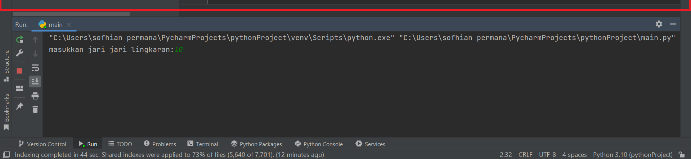

# lab2py
## Laporan Praktikum latihan bahasa pemrograman python

### Latihan 1 
Ini adalah langkah - langkah untuk membuat program pada Python
1) Install Python pada pc/laptop kalian. website nya https://www.python.org/ 

Pastikan setelah install, centang 'add python 3.x to path agar bisa dipanggil dari CMD

2) Jalankan Python melalui CMD untuk menampilkan tulisan dan angka pada Python.
Ketik python terlebih dahulu pada CMD untuk memanggil program python. 
Lalu, kata yang akan digunakan yaitu "hello" dan "Saya sedang belajar python". Dengan format print("kata yang ingin ditampilkan")

3) Selanjutnya adalah menampilkan angka dan menjumlahkan hasil penjumlahan dari dua buah variabel.
 
Dari program diatas dapat diketahui bahwa 'a=3' menunjukan bahwa di dalam variabel a adalah 3, begitu juga dengan 'b=4' artinya di dalam variable b adalah 4. 
Untuk mencetak angka, gunakan format print seperti pada penjelasan nomor 1), dan untuk menunjukan operasi penjumlahannya maka cetak terlebih dahulu tulisan nya lalu diikuti dengan tanda koma (,) dengan format penjumlahan dibelakangnya. Jangan lupa untuk save terlebih dahulu program yang dibuat agar bisa dijalankan.

4) Pada poin selanjutnya yaitu menjalankan IDLE Python. Lalu disini kita akan membuat fungsi input, bertujuan untuk memasukkan nilai sebuah variable dari keyboard. dan menggunakan operasi aritmatika untuk variabel yang sudah di input.

Gambar diatas menunjukkan program dari input nilai variabel, mencetak nilai variabel, menggabungkan yang bukan merupakan penjumlahan, dan melakukan operasi artimatika untuk penjumlahan dan pembagian. 
 
Gambar diatas merupakan output atau hasil dari program yang ada di gambar sebelumnya. masukkan terlebih dahulu angka pertama dan kedua untuk mengisi variabel a dan b yang masih kosong, maka akan ditampilkan untuk nilai variabel a dan b saat digabungkan dan dimasukkan ke dalam operasi aritmatika penjumlahan dan pembagian. 

5) Selanjutnya menjalankan sebuah program python pada aplikasi pycharm. 
Download terlebih dahulu aplikasi pycharm di https://www.jetbrains.com/pycharm/ . Kemudian install dan pastikan lokasi file di folder perangkat kita. Selanjutnya buat file baru pada pycharm. 
 
Selanjutnya adalah membuat program yang kita inginkan, disini kita akan membuat program untuk menghitung luas dan keliling sebuah lingkaran dengan nilai 'r' atau jari - jari yang sudah diinput. 

Gambar diatas dengan kotak merah menunjukkan sebuah program dari menghitung luas dan keliling lingkaran. 
Buat terlebih dahulu input untuk memasukkan nilai ke variabel r dan tambahkan keterangannya. 
Lalu tambahkan juga variabel 'pi' yang diisi dengan 3.14 sesuai dengan ketentuan pada matematika. Buat juga rumus luas lingkaran yang diinput ke variabel 'l' dan rumus keliling lingkaran yang diinput ke variabel 'k'. 
Pada penulisan rumus luas dan keliling, digunakan 'int(r)' yang artinya r adalah integer. integer adalah tipe data yang menginterpretasikan bilangan-bilangan bulat. 
Tampilkan kata kata yang menunjukkan luas lingkaran dan luas keliling. 

 
Disini bisa dilihat untuk output atau hasil dari program menghitung luas lingkaran dan keliling lingkaran yang sudah dibuat. bisa diinput dengan angka berapapun asalkan bilangan bulat. contoh di atas (kotak hijau) menampilkan angka yang diinput untuk r adalah 10, saat kita 'enter' maka hasil untuk luas dan keliling akan ditampilkan. 

SEKIAN TUTORIAL DAN PENJELASAN DARI CARA MEMBUAT PROGRAM PYTHON PADA CMD, IDLE, DAN PYCHARM :)